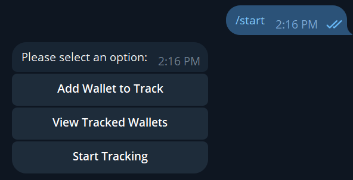
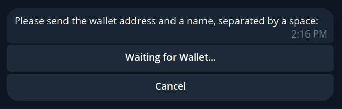
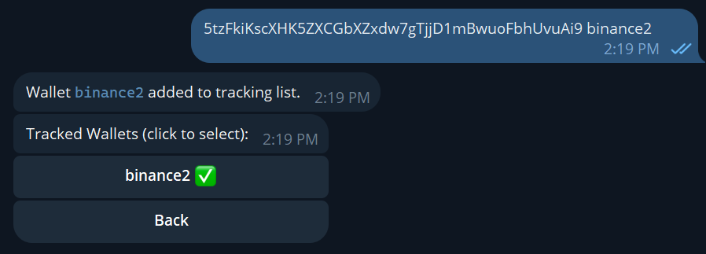
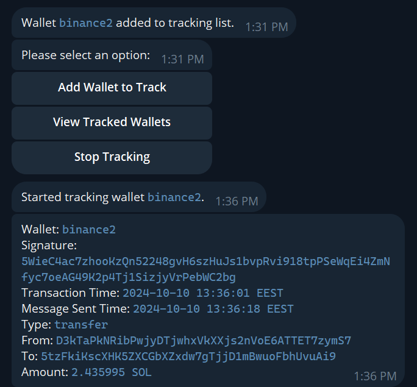
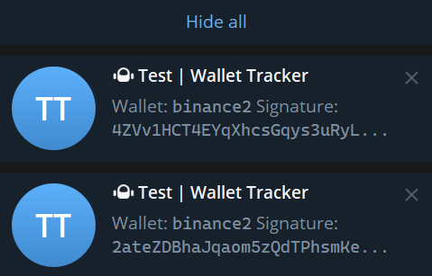
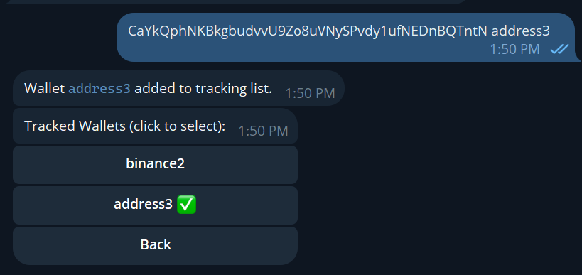

# Solana Tracker Bot

## Description

**SolanaTrackerBot** is a Python-based Telegram bot designed to track Solana wallet transactions. The bot allows users to monitor specific wallets and get notifications whenever new transactions are detected. The bot uses the Solana API for tracking and updates the users via Telegram notifications.

## Features

- Track specific Solana wallets and get notified about their latest transactions.
- Add or remove Solana wallets from tracking.
- View all wallets being tracked and start or stop tracking them.
- Uses asynchronous requests to fetch the latest transactions efficiently.
- Easy setup using environment variables for sensitive information such as the Telegram bot token.

## Project Structure

Here’s an overview of the project structure:

```
SolanaTrackerBot/
│
├── helpers/
│   ├── menu_handlers.py      # Logic for handling user commands and menus
│   └── wallet_tracker.py     # Logic for tracking Solana wallet transactions
├── screenshots               # Folder containing screenshots for the README.md
├── .env.example              # Example .env file without sensitive info
├── LICENSE                   # License information for the project
├── README.md                 # Project documentation
├── bot.py                    # Main bot script
└── requirements.txt          # List of dependencies
```

## Requirements

To run this project, you will need:

- **Python 3.7 or higher**
- Libraries:
  - `python-telegram-bot==20.3`
  - `python-dotenv==0.20.0`
  - `httpx==0.27.0`
  - `pytz==2024.1`
  - `cachetools==4.2.2`
  - `requests==2.31.0`
  - `beautifulsoup4==4.12.3` (if applicable)

### Python Libraries

Install the required libraries using the `requirements.txt` file:

```bash
pip install -r requirements.txt
```

Or install them manually:

```bash
pip install python-telegram-bot==20.3 python-dotenv==0.20.0 httpx==0.27.0 pytz==2024.1 cachetools==4.2.2 requests==2.31.0 beautifulsoup4==4.12.3
```

## Installation and Setup

Follow these steps to get the bot up and running:

### 1. Clone the Repository

First, clone the repository to your local machine:

```bash
git clone https://github.com/Glooring/SolanaTrackerBot.git
cd SolanaTrackerBot
```

### 2. Install Dependencies

Use the `requirements.txt` file to install the required Python libraries:

```bash
pip install -r requirements.txt
```

This will install the following libraries:
- `python-telegram-bot`: For interacting with the Telegram API.
- `python-dotenv`: To manage environment variables.
- `httpx`: For asynchronous HTTP requests to the Solana API.
- `cachetools`: For caching responses.
- `pytz`: For timezone handling.
- `beautifulsoup4`: If used for additional parsing.

### 3. Configure the Environment

#### Create the `.env` File

To keep your sensitive information secure (like the Telegram bot token), you'll use a `.env` file. 

1. Create a file named `.env` in the root directory of the project.
2. Add the following line, replacing `your-telegram-bot-token-here` with your actual bot token from Telegram:

```
TELEGRAM_BOT_TOKEN=your-telegram-bot-token-here
```

#### Example `.env` File

If you are unsure how to format the `.env` file, refer to `.env.example` as a guide:

```bash
# .env.example
TELEGRAM_BOT_TOKEN=your-telegram-bot-token-here
```

You should rename this file from `.env.example` to `.env` before using it.

### 4. Run the Bot

Once you’ve set up your environment and installed the necessary libraries, run the bot with:

```bash
python bot.py
```

This will start the bot, and you can begin interacting with it via Telegram.

---

## Usage

### Starting the Bot

1. In your Telegram app, find your bot by searching for its name or using its bot link.
2. Send the `/start` command to the bot to begin interacting.

```bash
/start
```

- **Screenshot Example**:  


The bot will welcome you and provide an option to select actions such as adding wallets to track or viewing tracked wallets.

---

### Adding a Solana Wallet to Track

1. After starting the bot, click on the **"Add Wallet to Track"** button.
2. You will then be prompted to enter a Solana wallet address and a custom name for the wallet in the following format:

   ```
   wallet-address wallet-name
   ```

   - **Screenshot Example**:  



3. Once the wallet is added, it will appear in the list of tracked wallets. You will need to:
   - **Checkmark** the wallet to select it for tracking.
   - After selecting the wallet, press the **"Back"** button to return to the main menu.
   - **Screenshot Example**:  


4. After going back to the main menu, press **"Start Tracking"** to begin tracking the selected wallet.

   - **Screenshot Example**:  


5. Once tracking starts, the bot will notify you via Telegram whenever a new transaction is detected for the tracked wallet.

   - **Screenshot Example (Notification)**:  


---

### Managing Tracked Wallets

- The bot provides options to view all tracked wallets, and start or stop tracking specific wallets.
- You can view your currently tracked wallets and toggle tracking on/off using Telegram's inline keyboard interface.

- **Screenshot Example**:  



---

## How It Works

### Web Scraping Logic

The bot interacts with the Solana blockchain via asynchronous HTTP requests (using the `httpx` library) to fetch the latest transactions from specific wallets. It caches the results for efficiency using `cachetools` and notifies users when new transactions are detected.

Here is a simplified version of the core tracking logic located in `helpers/wallet_tracker.py`:

```python
import httpx
import asyncio
import os

TELEGRAM_TOKEN = os.getenv('TELEGRAM_BOT_TOKEN')

async def start_periodic_task(chat_id, context, wallet_address, user_data):
    while True:
        payload_transactions = {
            "jsonrpc": "2.0",
            "id": 1,
            "method": "getConfirmedSignaturesForAddress2",
            "params": [wallet_address, {"limit": 10}]
        }
        async with httpx.AsyncClient() as client:
            response = await client.post("https://api.mainnet-beta.solana.com", json=payload_transactions)
        if response.status_code == 200:
            # Process transactions and send updates to the user
            pass
        await asyncio.sleep(5)
```

### Telegram Integration

The bot uses the `python-telegram-bot` library to handle commands, messages, and inline keyboard interactions in Telegram. It supports features like:
- `/start` command to initialize the bot.
- Inline keyboard buttons to manage wallets.
- Asynchronous message sending with retry logic to handle network failures.

---

## Contributing

If you'd like to contribute to this project, feel free to fork the repository, make your changes, and submit a pull request. You can also open an issue for discussion.

---

## License

This project is licensed under the MIT License. See the [LICENSE](LICENSE) file for details.

---

### Notes on Deployment

- **Security**: Ensure that the `.env` file (which contains your Telegram bot token) is not shared publicly or committed to version control. The `.env` file is already included in `.gitignore` to avoid accidental uploads.
- **Scalability**: The bot is designed to handle multiple wallets, but depending on usage, you may need to adjust the polling interval or optimize the tracking process for more extensive usage.
